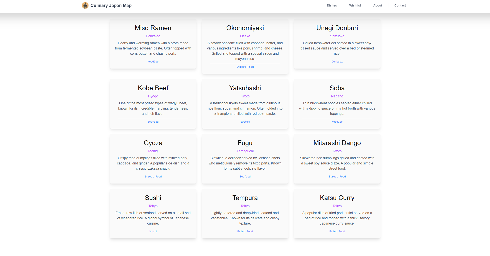

# Culinary-Japan-Map

A full-stack web application that serves as a personal guide to Japan's regional cuisine. Discover hidden culinary gems and manage a personal wish list of dishes to try. This project is built while following the learning path of the book "The Complete Developer" by Martin Krause.

    

## Tech Stack

* **Framework:** Next.js
* **Language:** TypeScript
* **Database:** MongoDB with Mongoose
* **API:** GraphQL
* **Authentication:** Next-Auth (with GitHub OAuth)
* **Styling:** Tailwind CSS
* **Testing:** Jest
* **Containerization:** Docker

